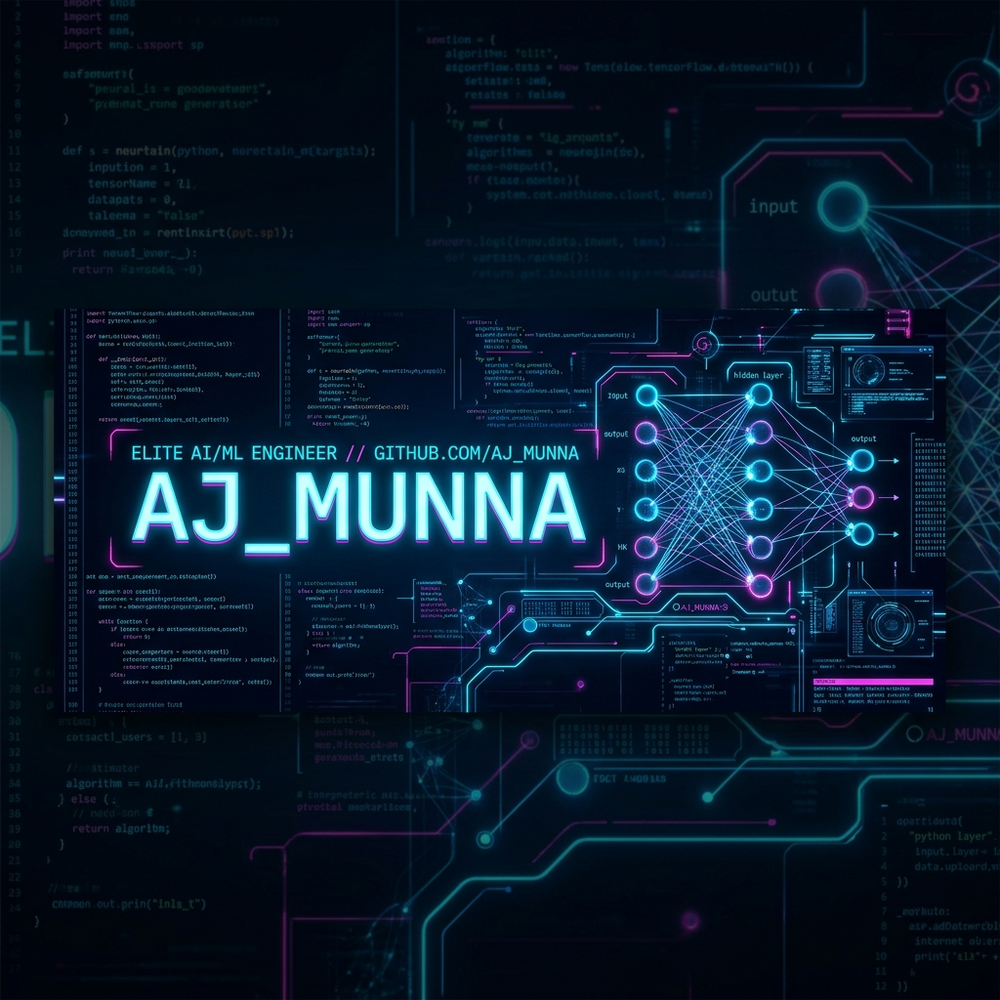

<p align="center">
  
</p>

<p align="center">
  <a href="https://git.io/typing-svg">
    
  </a>
</p>

<p align="center">
  <code>&gt;&gt; [SYS_STATUS]: NEURAL CORE ONLINE // ACCESS LEVEL: OMEGA // DEEP LEARNING LOGS DECRYPTED.</code>
</p>

<br />

> **`[SYS_OVERVIEW]`** An elite Machine Learning / AI Engineer operating at the intersection of deep neural networks, computer vision, and edge computing. Specializes in optimizing transformer architectures, building high-throughput low-latency inference pipelines, and distilling massive models to run on resource-constrained hardware.

---

## ▣ NEURAL WEAPON SYSTEMS

### ⚔️ CORE LANGUAGES
<p align="left">
  
  
  
  
  
  
</p>

### 🧠 NEURAL FRAMEWORKS
<p align="left">
  
  
  
  
  
</p>

### 📼 DATA SYSTEMS & INFRASTRUCTURE
<p align="left">
  
  
  
  
</p>

### 📡 DEPLOYMENT & MLOPS PROTOCOLS
<p align="left">
  
  
  
  
</p>

### 🛠️ DEVELOPMENT TOOLS & ARCHITECTURES
<p align="left">
  
  
  
  
  
</p>

---

## ◉ MISSION ARCHIVE (EXPERIENCE)

### ┌── OPERATION: THE DATA ISLAND
│   **Role:** Junior AI Engineer &nbsp;|&nbsp; **Duration:** April 2026 – Present
│
│   **Objective:** Architect and deploy high-throughput, real-time data pipelines.
│   **Threats Mitigated:** Distributed model latency, high-volume pipeline data overhead.
│   **System Upgrades:** Hardened production ML pipelines and streamlined core model integrations.
└──

### ┌── OPERATION: NSU NEURAL ACADEMY
│   **Role:** Undergraduate Teaching Assistant &nbsp;|&nbsp; **Duration:** June 2025 – Present
│
│   **Objective:** Educate, grade, and mentor undergraduate students within the Department of ECE.
│   **Threats Mitigated:** Bridging complex theoretical engineering paradigms with practical execution.
│   **System Upgrades:** Mentored students in core engineering projects, facilitated technical laboratory sessions.
└──

### ┌── OPERATION: NIPPON AI DOJO
│   **Role:** AI Engineering Operative &nbsp;|&nbsp; **Duration:** Sept 2025 – Jan 2026
│
│   **Objective:** Deepen model optimization and computer vision capabilities under direct mentorship of Tokyo’s industry experts.
│   **Threats Mitigated:** Running highly demanding artificial intelligence models on low-power edge nodes.
│   **System Upgrades:** Engineered, refined, and deployed highly optimized production-grade vision models.
└──

---

## ⚔️ BOSS FIGHTS (COMPLEX ML CONFLICTS)

### ┌── BOSS FIGHT 01: COMPACT RENAL CALCULI DETECTION
│   **Status:** Victory (Research Under Review at SPICSCON 2026)
│   **Core Tactics:** Knowledge Distillation from a ConvNeXt-Tiny teacher to a hybrid CNN-MobileViT model.
│
│   **Metrics:** 
│   * **18.5x Parameter Compression:** Shrunk model from 28.6M to a mere 1.54M parameters.
│   * **99.80% Accuracy:** Achieved medical-grade precision on edge hardware.
│   * **Speed Run:** Completed entire training cycle in 9 minutes on a resource-constrained NVIDIA T4 GPU.
└──

### ┌── BOSS FIGHT 02: BONE FRACTURE DIAGNOSTIC TRANSFOMERS
│   **Status:** Victory (Published in IEEE SATC 2026, Houston, TX)
│   **Core Tactics:** Comparative analysis of Pooling-based Vision Transformers (PiT) vs. Causal Transformers (CaFormer).
│
│   **Metrics:**
│   * **97.51% Testing Accuracy:** Automated fracture detection.
│   * **Access Node:** [IEEE Xplore (DOI: 10.1109/SATC69565.2026.11542322)](https://doi.org/10.1109/SATC69565.2026.11542322)
└──

---

## ▣ DATA VAULT (EXPERIMENTS)

### ┌── PROJECT: MiST-ER (Temporal Emotion Recognition)
│   **Type:** Multimodal Deep Learning Pipeline
│   **Stack:** PyTorch, Transformers, Cross-Modal Attention, Feature Synchronization
│
│   **Performance:** Achieved 54% accuracy on the MESC micro-emotion dataset.
│   **Architecture:** Engineered cross-modal attention and bidirectional fusion to isolate relevant temporal frames.
│   **Access Port:** [Decrypt Datastream](https://github.com/iam-ajmunna/MiST-ER)
└──

### ┌── PROJECT: FOIL STAMPING MONITOR
│   **Type:** Computer Vision Industrial Automation
│   **Stack:** Python, OpenCV, NVIDIA DeepStream, FFmpeg
│
│   **Performance:** Ultra-low latency inspection stream monitoring high-throughput lines.
│   **Architecture:** Deployed optimized real-time computer vision logic directly to production nodes.
│   **Access Port:** [Decrypt Datastream](https://github.com/iam-ajmunna/Industrial-Automation)
└──

---

## 📊 SYSTEM METRICS PANEL

<div align="center">
  <table border="0">
    <tr>
      <td width="50%" align="center">
        
      </td>
      <td width="50%" align="center">
        
      </td>
    </tr>
    <tr>
      <td colspan="2" align="center">
        <br />
        
      </td>
    </tr>
  </table>
</div>

---

## 🏆 ACHIEVEMENT MATRIX (UNLOCKED UPGRADES)

- [x] **UPGRADE [RESEARCH_NODE_01]**: Published First-Author paper at *IEEE SATC 2026* (Houston, USA) on Vision Transformers.
- [x] **UPGRADE [RESEARCH_NODE_02]**: Submitted research on parameter-efficient hybrid CNN-MobileViT model to *SPICSCON 2026*.
- [x] **UPGRADE [DOJO_CERTIFICATION]**: Unlocked certificate for completing the intensive *Nippon AI Dojo 2025* program under Chowa Giken & AI Samurai Japan.
- [x] **UPGRADE [ACADEMIC_EXCELLENCE]**: Maintained **3.75 / 4.00 CGPA** during Bachelor of Science in Computer Science and Engineering at North South University.

---

## 📡 SECURE COMMUNICATION TERMINAL

```bash
$ establish_link --target linkedin
> CONNECTING TO NEURAL LINK DATABASE...
> TARGET SECURED: linkedin.com/in/iamajmunna
```

```bash
$ establish_link --target email
> INITIATING SECURE COMMS PROTOCOL...
> TARGET SECURED: iam.ajmunna@gmail.com
```

<div align="center">
  <br />
  <a href="https://linkedin.com/in/iamajmunna">
    
  </a>
  &nbsp;&nbsp;
  <a href="mailto:iam.ajmunna@gmail.com">
    
  </a>
  &nbsp;&nbsp;
  <a href="https://github.com/iam-ajmunna">
    
  </a>
</div>
