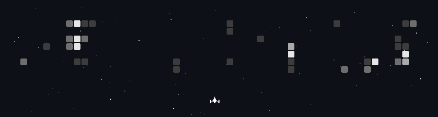

<!-- SPACE SHOOTER — auto-updated daily via GitHub Actions -->

  

<!-- Setup: add czl9707/gh-space-shooter Action to .github/workflows/update-game.yml -->
<!-- See: https://github.com/czl9707/gh-space-shooter -->

 

  &nbsp;
  &nbsp;
  &nbsp;
  

 

  <b>Deep Learning &nbsp;•&nbsp; Computer Vision &nbsp;•&nbsp; Edge AI </b>

 

---

### `~/tech-stack`

 

<table align="center" width="88%">
  <tr>
    <td align="right" width="22%"><b>LANGUAGES</b></td>
    <td>
      <kbd>Python</kbd>&nbsp;
      <kbd>C++</kbd>&nbsp;
      <kbd>JavaScript</kbd>&nbsp;
      <kbd>Dart</kbd>&nbsp;
      <kbd>Java</kbd>&nbsp;
      <kbd>LaTeX</kbd>
    </td>
  </tr>
  <tr>
    <td align="right"><b>AI · ML · CV</b></td>
    <td>
      <kbd>PyTorch</kbd>&nbsp;
      <kbd>TensorFlow</kbd>&nbsp;
      <kbd>Hugging Face</kbd>&nbsp;
      <kbd>SAM</kbd>&nbsp;
      <kbd>Transformers</kbd>&nbsp;
      <kbd>OpenCV</kbd>&nbsp;
      <kbd>NVIDIA DeepStream</kbd>&nbsp;
      <kbd>Knowledge Distillation</kbd>
    </td>
  </tr>
  <tr>
    <td align="right"><b>DATABASES</b></td>
    <td>
      <kbd>SQL</kbd>&nbsp;
      <kbd>PostgreSQL</kbd>&nbsp;
      <kbd>MySQL</kbd>
    </td>
  </tr>
  <tr>
    <td align="right"><b>DEVOPS & TOOLS</b></td>
    <td>
      <kbd>Docker</kbd>&nbsp;
      <kbd>Linux (Ubuntu)</kbd>&nbsp;
      <kbd>FFmpeg</kbd>&nbsp;
      <kbd>Git</kbd>&nbsp;
      <kbd>MLOps</kbd>
    </td>
  </tr>
  <tr>
    <td align="right"><b>FRONTEND · APPS</b></td>
    <td>
      <kbd>React.js</kbd>&nbsp;
      <kbd>Next.js</kbd>&nbsp;
      <kbd>Flutter</kbd>&nbsp;
      <kbd>RESTful APIs</kbd>&nbsp;
      <kbd>System Design</kbd>
    </td>
  </tr>
</table>

 

  <code>// engineering intelligence </code>

 
